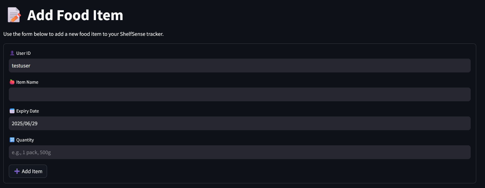
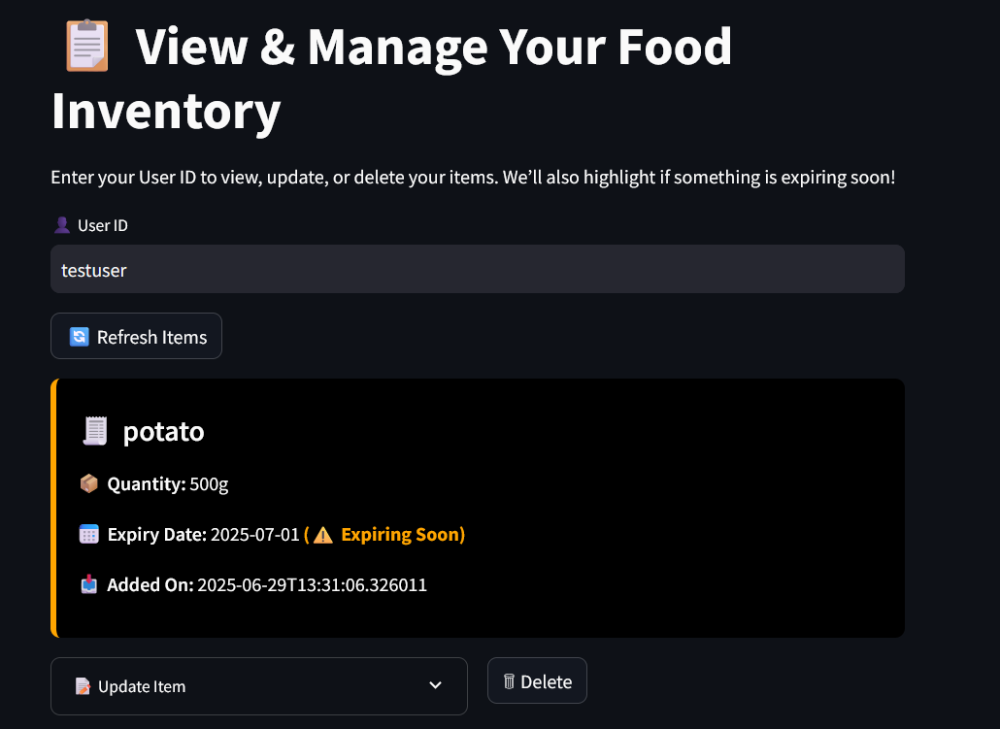
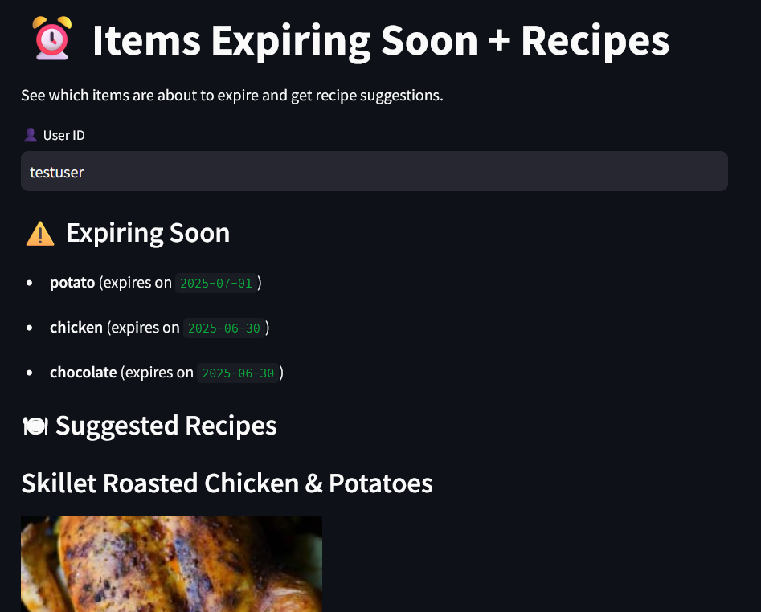

# 🛒 ShelfSense

*A smart food inventory tracker that helps you manage your groceries, alerts you before they expire, and even suggests recipes! 🍅⏰📬*


---

## 🌟 Features

* 📥 **Add Items**: Enter item name, quantity, and expiry date.
* 🔍 **View Items**: See your inventory in a clean dashboard.
* 🔄 **Update/Delete Items**: Easily modify or remove items.
* 🕒 **Expiry Alerts**: Get notified via SMS/email before items expire.
* 🍽️ **Recipe Suggestions**: Smart recipes using soon-to-expire items.
* 📊 **Analytics (Optional)**: View ingredient usage trends.
* 🔁 **Daily Check**: Uses AWS EventBridge to run expiry checks daily.

---

## 📸 Screenshots

| Add Items | View Items | Expiring Items with Recipes |
| --------- | ---------- | --------------------------- |
|  |  |  |

---

## 🔧 Built With

| Tech | Purpose |
| ---- | ------- |
| Streamlit | UI for viewing & managing groceries |
| AWS Lambda | Serverless backend logic |
| Amazon API Gateway | Exposes APIs to interact with Lambda |
| Amazon DynamoDB | NoSQL database for item storage |
| Amazon SNS | Sends expiry alerts via email/SMS |
| Amazon EventBridge | Schedules daily expiry checks |
| Spoonacular API | Fetches recipes from expiring ingredients |
| Terraform | Infrastructure as Code |
| Python | Core logic and backend functions |

---

## 📁 Folder Structure

```
📦 ShelfSense/
├── terraform/          # Terraform configs (main.tf, variables.tf, etc.)
├── lambda/             # All Lambda function .py and .zip files
├── ui/                 # Streamlit frontend
│   ├── pages/          # Streamlit subpages (Add, View, Analytics...)
│   ├── utils/          # API utilities
│   └── .env            # API Gateway + Spoonacular keys (not committed)
├── .gitignore
├── requirements.txt
└── README.md
```

---

## ⚙️ Setup Instructions

### 1. 🔒 Create a `.env` file in `ui/`

```env
API_BASE_URL=https://your-api-id.execute-api.ap-south-1.amazonaws.com/dev
SPOONACULAR_API_KEY=your_spoonacular_api_key
```

### 2. 🏗 Deploy Infrastructure

```bash
cd terraform
terraform init
terraform apply
```

### 3. 🧠 Package and Upload Lambda Code

```bash
cd lambda
zip add_item_lambda.zip add_item_lambda.py
zip get_items_lambda.zip get_items_lambda.py
# repeat for other Lambda files
```

### 4. 🚀 Run the UI

```bash
cd ui
python -m venv venv
source venv/bin/activate  # or venv\Scripts\activate on Windows
pip install -r requirements.txt
streamlit run app.py
```

---

## 📬 Notifications

ShelfSense uses Amazon SNS to send alerts:

* ✅ Supports both **Email** and **SMS**
* 🕒 Triggered every day at **8:30 AM IST** by AWS EventBridge
* 💡 Items expiring within 2 days are notified

---

## 🚀 Future Improvements (Optional)

* 🔒 Add Cognito-based user authentication
* 📱 Mobile responsiveness (via Streamlit Community Components)
* 🧠 ML-based expiry prediction based on category
* 📉 Enhanced analytics dashboard with charts

---

## 👨‍💻 Author

Made with 💚 by [Parth Yangandul](https://github.com/parthyang)

---

## 📄 License

MIT License. Feel free to use and contribute!